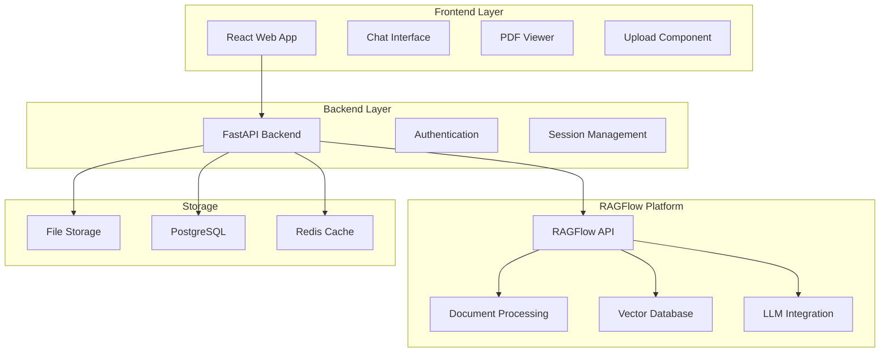

# Design Document

## Overview

The PDF Chat App will be built as a web application that leverages RAGFlow as the core RAG (Retrieval-Augmented Generation) engine. RAGFlow provides robust document processing, vector storage, and retrieval capabilities, allowing us to focus on creating an amazing user experience. The application will consist of a React frontend and a Python/FastAPI backend that interfaces with RAGFlow's APIs.

## Architecture

### High-Level Architecture



### Technology Stack

**Frontend:**
- React 18 with TypeScript
- Tailwind CSS for styling
- React Query for state management
- React PDF for document viewing
- Socket.io for real-time updates

**Backend:**
- FastAPI (Python) for API layer
- SQLAlchemy for database ORM
- Redis for session and caching
- RAGFlow Python SDK for integration

**Infrastructure:**
- RAGFlow (self-hosted or cloud)
- PostgreSQL for metadata storage
- Redis for caching and sessions
- File storage (local or S3-compatible)

## Components and Interfaces

### 1. Frontend Components

#### Chat Interface Component
- **Purpose**: Handle user questions and display AI responses
- **Key Features**:
  - Message history with timestamps
  - Typing indicators during processing
  - Citation links that highlight PDF sections
  - Follow-up question suggestions
- **State Management**: Conversation history, current document context

#### PDF Viewer Component
- **Purpose**: Display PDF documents with highlighting capabilities
- **Key Features**:
  - Page navigation and zoom controls
  - Text highlighting for citations
  - Responsive design for mobile/desktop
  - Integration with chat citations
- **Library**: React-PDF or PDF.js wrapper

#### Document Manager Component
- **Purpose**: Handle multiple document uploads and selection
- **Key Features**:
  - Drag-and-drop upload interface
  - Document list with processing status
  - Document selection for querying
  - Delete and rename functionality

### 2. Backend API Endpoints

#### Document Management API
```python
POST /api/documents/upload
GET /api/documents/
GET /api/documents/{doc_id}
DELETE /api/documents/{doc_id}
GET /api/documents/{doc_id}/status
```

#### Conversation API
```python
POST /api/conversations/
GET /api/conversations/{conv_id}
POST /api/conversations/{conv_id}/messages
GET /api/conversations/{conv_id}/history
```

#### RAGFlow Integration API
```python
POST /api/ragflow/process-document
POST /api/ragflow/query
GET /api/ragflow/status/{task_id}
```

### 3. RAGFlow Integration Layer

#### Document Processing Service
- **Purpose**: Interface with RAGFlow for document ingestion
- **Responsibilities**:
  - Upload PDFs to RAGFlow
  - Monitor processing status
  - Handle processing errors
  - Extract document metadata

#### Query Service
- **Purpose**: Handle question-answering through RAGFlow
- **Responsibilities**:
  - Format user queries for RAGFlow
  - Process RAGFlow responses
  - Extract citations and confidence scores
  - Handle multi-document queries

## Data Models

### Database Schema

#### Documents Table
```sql
CREATE TABLE documents (
    id UUID PRIMARY KEY,
    user_id UUID NOT NULL,
    filename VARCHAR(255) NOT NULL,
    original_filename VARCHAR(255) NOT NULL,
    file_size INTEGER NOT NULL,
    upload_date TIMESTAMP DEFAULT NOW(),
    processing_status VARCHAR(50) DEFAULT 'pending',
    ragflow_document_id VARCHAR(255),
    page_count INTEGER,
    metadata JSONB,
    created_at TIMESTAMP DEFAULT NOW(),
    updated_at TIMESTAMP DEFAULT NOW()
);
```

#### Conversations Table
```sql
CREATE TABLE conversations (
    id UUID PRIMARY KEY,
    user_id UUID NOT NULL,
    document_ids UUID[] NOT NULL,
    title VARCHAR(255),
    created_at TIMESTAMP DEFAULT NOW(),
    updated_at TIMESTAMP DEFAULT NOW()
);
```

#### Messages Table
```sql
CREATE TABLE messages (
    id UUID PRIMARY KEY,
    conversation_id UUID NOT NULL REFERENCES conversations(id),
    role VARCHAR(20) NOT NULL, -- 'user' or 'assistant'
    content TEXT NOT NULL,
    citations JSONB,
    confidence_score FLOAT,
    created_at TIMESTAMP DEFAULT NOW()
);
```

#### Users Table
```sql
CREATE TABLE users (
    id UUID PRIMARY KEY,
    email VARCHAR(255) UNIQUE,
    created_at TIMESTAMP DEFAULT NOW(),
    preferences JSONB DEFAULT '{}'
);
```

### RAGFlow Data Models

#### Document Processing Request
```python
class DocumentProcessRequest:
    file_path: str
    document_id: str
    processing_options: Dict[str, Any]
```

#### Query Request
```python
class QueryRequest:
    question: str
    document_ids: List[str]
    conversation_context: Optional[List[Dict]]
    max_results: int = 5
```

#### Query Response
```python
class QueryResponse:
    answer: str
    citations: List[Citation]
    confidence_score: float
    sources: List[DocumentChunk]
```

#### Citation Model
```python
class Citation:
    document_id: str
    page_number: int
    text_excerpt: str
    start_position: int
    end_position: int
    confidence: float
```

## Error Handling

### Document Processing Errors
- **Invalid PDF Format**: Clear error message with supported formats
- **Processing Timeout**: Retry mechanism with user notification
- **RAGFlow Service Unavailable**: Graceful degradation with queue system
- **Large File Handling**: Size limits with compression suggestions

### Query Processing Errors
- **No Relevant Content**: "I couldn't find information about that in your document"
- **Ambiguous Questions**: Request for clarification with suggestions
- **Service Timeouts**: Retry with exponential backoff
- **Context Loss**: Conversation recovery mechanisms

### User Experience Errors
- **Network Issues**: Offline mode with cached conversations
- **Authentication Failures**: Seamless re-authentication
- **Browser Compatibility**: Graceful fallbacks for older browsers

## Testing Strategy

### Unit Testing
- **Frontend Components**: React Testing Library for UI components
- **Backend Services**: Pytest for API endpoints and business logic
- **RAGFlow Integration**: Mock RAGFlow responses for consistent testing
- **Database Operations**: Test database transactions and migrations

### Integration Testing
- **End-to-End Workflows**: Document upload → processing → querying
- **RAGFlow Integration**: Test actual RAGFlow API interactions
- **Multi-Document Scenarios**: Cross-document query testing
- **Citation Accuracy**: Verify citation links and highlighting

### Performance Testing
- **Document Processing**: Test with various PDF sizes and types
- **Concurrent Users**: Load testing with multiple simultaneous queries
- **Response Times**: Ensure sub-3-second response times
- **Memory Usage**: Monitor resource consumption with large documents

### User Acceptance Testing
- **Usability Testing**: Test with target users (students, researchers)
- **Accessibility Testing**: Screen reader and keyboard navigation
- **Mobile Responsiveness**: Test across different device sizes
- **Browser Compatibility**: Test on major browsers

## Security Considerations

### Data Protection
- **File Encryption**: Encrypt uploaded PDFs at rest
- **Secure Transmission**: HTTPS for all API communications
- **User Isolation**: Ensure users can only access their own documents
- **Data Retention**: Configurable document deletion policies

### Authentication & Authorization
- **JWT Tokens**: Secure session management
- **Rate Limiting**: Prevent abuse of API endpoints
- **Input Validation**: Sanitize all user inputs
- **CORS Configuration**: Proper cross-origin request handling

### RAGFlow Security
- **API Key Management**: Secure storage of RAGFlow credentials
- **Network Security**: VPN or private network for RAGFlow communication
- **Data Isolation**: Ensure tenant separation in RAGFlow
- **Audit Logging**: Track all document processing and queries

## Performance Optimization

### Frontend Optimization
- **Code Splitting**: Lazy load components for faster initial load
- **PDF Rendering**: Virtualized rendering for large documents
- **Caching**: Cache processed documents and conversation history
- **Compression**: Optimize asset delivery with gzip/brotli

### Backend Optimization
- **Database Indexing**: Optimize queries with proper indexes
- **Connection Pooling**: Efficient database connection management
- **Caching Strategy**: Redis for frequently accessed data
- **Async Processing**: Non-blocking document processing

### RAGFlow Optimization
- **Chunking Strategy**: Optimize chunk size for better retrieval
- **Vector Indexing**: Configure optimal embedding parameters
- **Query Optimization**: Batch similar queries when possible
- **Resource Management**: Monitor RAGFlow resource usage

## Deployment Architecture

### Development Environment
- **Docker Compose**: Local development with all services
- **RAGFlow Setup**: Local RAGFlow instance for development
- **Database**: PostgreSQL container with test data
- **Redis**: Local Redis instance for caching

### Production Environment
- **Container Orchestration**: Kubernetes or Docker Swarm
- **Load Balancing**: NGINX or cloud load balancer
- **Database**: Managed PostgreSQL (AWS RDS, Google Cloud SQL)
- **File Storage**: S3-compatible object storage
- **RAGFlow**: Dedicated RAGFlow cluster with GPU support

### Monitoring and Observability
- **Application Metrics**: Response times, error rates, user activity
- **RAGFlow Metrics**: Document processing times, query performance
- **Infrastructure Metrics**: CPU, memory, disk usage
- **Logging**: Centralized logging with ELK stack or similar
- **Alerting**: Automated alerts for system issues

This design leverages RAGFlow's strengths while creating a focused, user-friendly application that delivers the core value proposition of conversational PDF interaction.